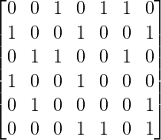
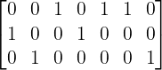
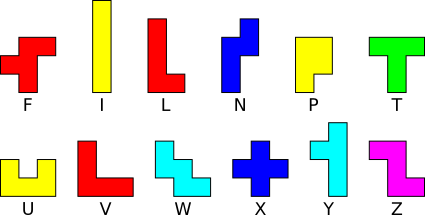
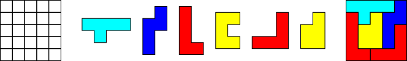

## Resolvendo problemas de cobertura exata

### O problema de cobertura exata
Conforme a [Wikipédia](https://en.wikipedia.org/wiki/Exact_cover), dada um coleção **S** de subconjuntos de um conjunto 
**X**, uma **cobertura exata** é uma subcoleção **S*** de **S**, tal que cada elemento em **X** está contido em
exatamente um subconjunto em **S***.

Para facilitar um pouco o entendimento, considere o seguinte problema: Dada uma matriz de zeros e uns, qual é o conjunto
de linhas cujas colunas contém apenas exatamente um "1"?

Para a matriz da figura acima, o conjunto **S** conteria todas as linhas, e a subcoleção **S*** corresponderia às linhas
1, 4 e 5 da matriz:

A fim de encontrar a solução para este tipo de problema no formato de matriz, Donald Knuth propôs o  Algoritmo X, que
corresponde a uma busca de tentativa e erro implementada de forma recursiva, onde a cada nível de recursão uma possível
solução do problema vai sendo construída até que se obtenha sucesso.

Para implementar o Algoritmo X, Donald utilizou uma técnica que ele chamou de "Dancing Links", a qual utiliza de 
ponteiros indicando a posição relativa dos "uns" que estão na matriz gerando o Algoritmo DLX.

Para mais detalhes sobre o Algoritmo X e o DLX, veja o [artigo original](https://arxiv.org/abs/cs/0011047).

### Explicação com pentaminós

[Pentaminós](https://en.wikipedia.org/wiki/Pentomino) são peças compostas de cinco quadrados congruentes conectados
ortogonalmente. Existem 12 pentaminós, identificados por letras conforme a figura a seguir:

Os quebra-cabeças com pentaminós geralmente consistem em cobrir um tabuleiro com as peças deixando ou não alguns espaços
vagos:

A representação matricial deste problema 

### Resolvendo o quebra-cabeças do calendário
- Ibagens

## Algoritmos implementados
- Comentar do python não ter ponteiros
asd

## Referências

[Exact Cover - Wikipédia](https://en.wikipedia.org/wiki/Exact_cover)

[Donald Knuth - Dancing Links](https://arxiv.org/abs/cs/0011047)

[Donald Knuth - Implementação dos algoritmos](https://www-cs-faculty.stanford.edu/~knuth/programs.html)

[Pentomino - Wikipédia](https://en.wikipedia.org/wiki/Pentomino)
