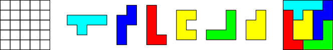
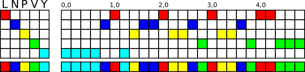

## Resolvendo problemas de cobertura exata

### O problema de cobertura exata
Conforme a [Wikipédia](https://en.wikipedia.org/wiki/Exact_cover), dada um coleção **S** de subconjuntos de um conjunto 
**X**, uma **cobertura exata** é uma subcoleção **S*** de **S**, tal que cada elemento em **X** está contido em
exatamente um subconjunto em **S***.

Para facilitar um pouco o entendimento, considere o seguinte problema: Dada uma matriz de zeros e uns, qual é o conjunto
de linhas cujas colunas contém apenas exatamente um "1"?

<p align="center">

</p>

Para a matriz da figura acima, o conjunto **S** conteria todas as linhas, e a subcoleção **S*** corresponderia às linhas
1, 4 e 5 da matriz:

<p align="center">

</p>


A fim de encontrar a solução para este tipo de problema no formato de matriz, Donald Knuth propôs o  Algoritmo X, que
corresponde a uma busca de tentativa e erro implementada de forma recursiva, onde a cada nível de recursão uma possível
solução do problema vai sendo construída até que se obtenha sucesso.

Para implementar o Algoritmo X, Donald utilizou uma técnica que ele chamou de "Dancing Links", a qual utiliza de 
ponteiros indicando a posição relativa dos "uns" que estão na matriz gerando o Algoritmo DLX.

Para mais detalhes sobre o Algoritmo X e o DLX, veja o [artigo original](https://arxiv.org/abs/cs/0011047).


### Explicação com pentaminós

[Pentaminós](https://en.wikipedia.org/wiki/Pentomino) são peças compostas de cinco quadrados congruentes conectados
ortogonalmente. Existem 12 pentaminós, identificados por letras conforme a figura a seguir:

<p align="center">

</p>

Os quebra-cabeças com pentaminós geralmente consistem em cobrir um tabuleiro com as peças deixando ou não alguns espaços
vagos:

<p align="center">

</p>

A representação matricial de um quebra-cabeças de pentaminós como um problema de cobertura exata é feita da seguinte
forma:

Cada possível local de uma peça de pentaminó no tabuleiro é representada por uma linha da matriz, composta por colunas
que identificam a peça e por colunas que identificam onde a peça foi colocada no tabuleiro, conforme a imagem:

<p align="center">

</p>

Dessa forma, a matriz terá várias linhas contendo todas as posições e variações possíveis de como uma peça pode ser
colocada no tabuleiro, assim o algoritmo terá de encontrar as linhas que correspondem a um tabuleiro completamente
preenchido.

## Algoritmos implementados
Os algoritmos foram implementados em Python, o DLX em especial optei por usar uma dataclass contendo ponteiros para a
implementação do "Dancing Links".

* ```dlx_algorithm.py```: Implementação do algoritmo DLX, ao longo do algoritmo existem alguns comentários referenciando
o pseudo-código do artigo do Knuth. Apenas a primeira solução encontrada é retornada;
* ```polymino_cover_problem.py```: Implementação de um gerador de matriz do problema de cobertura de quebra-cabeças com
poliminós. Inclui uma opção para deixar lacunas vazias;
* ```pentaminoes.py```: Representação das peças de pentaminó no formato de matriz do Numpy;
* ```plot_solution.py```: Plota a solução obtida pelo algoritmo DLX;
* ```classic_pentomino.py```: Exemplo da solução de problemas clássicos de pentaminós;
* ```scott_problem.py```: Exemplo da solução do problema de Dana Scott, citado no artigo do Donald Kuth;
* ```calendar_puzzle.py```: Exemplo da solução do quebra-cabeças de calendário, que utiliza peças de pentaminós e uma
peça de hexaminó.

### Resolvendo o quebra-cabeças do calendário

Aqui está uma das aplicações desse algoritmo, um quebra-cabeças de calendário. A ideia é que você coloque todas as peças
no tabuleiro, deixando aparente apenas um mês e um dia. 

<p align="center">

</p>

Para a solução o tabuleiro é considerado de forma retangular, então os quadrados abaixo dos dias [25, 26, 27, 28] e dos
meses de junho e dezembro serão considerados como preenchidos, além do dia e mês escolhidos. Estes quadrados já
preenchidos serão considerados como uma "peça extra" para entrar na matriz de solução.

Pela figura, observe que uma das peças é um hexaminó.

O restante do programa é executado normalmente e o resultado é plotado no final (Os quadrados com # correspondem às
lacunas deixadas no tabuleiro):

<p align="center">

</p>

## Referências

[Exact Cover - Wikipédia](https://en.wikipedia.org/wiki/Exact_cover)

[Donald Knuth - Dancing Links](https://arxiv.org/abs/cs/0011047)

[Donald Knuth - Implementação dos algoritmos](https://www-cs-faculty.stanford.edu/~knuth/programs.html)

[Pentomino - Wikipédia](https://en.wikipedia.org/wiki/Pentomino)
